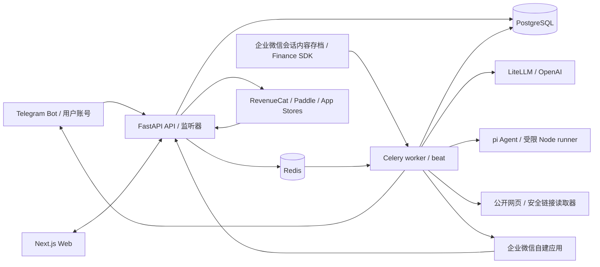
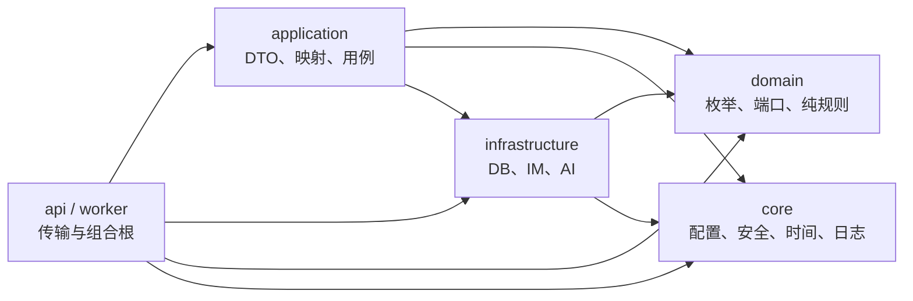
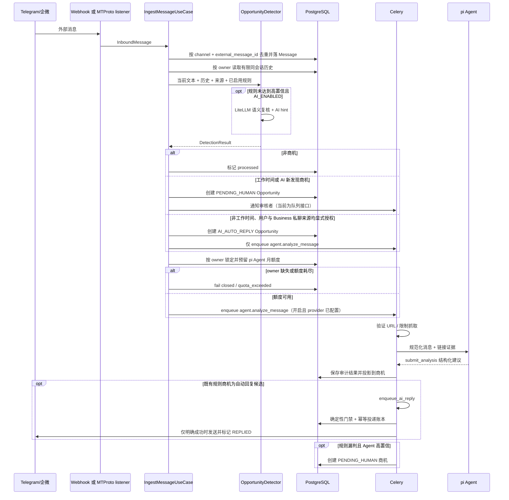
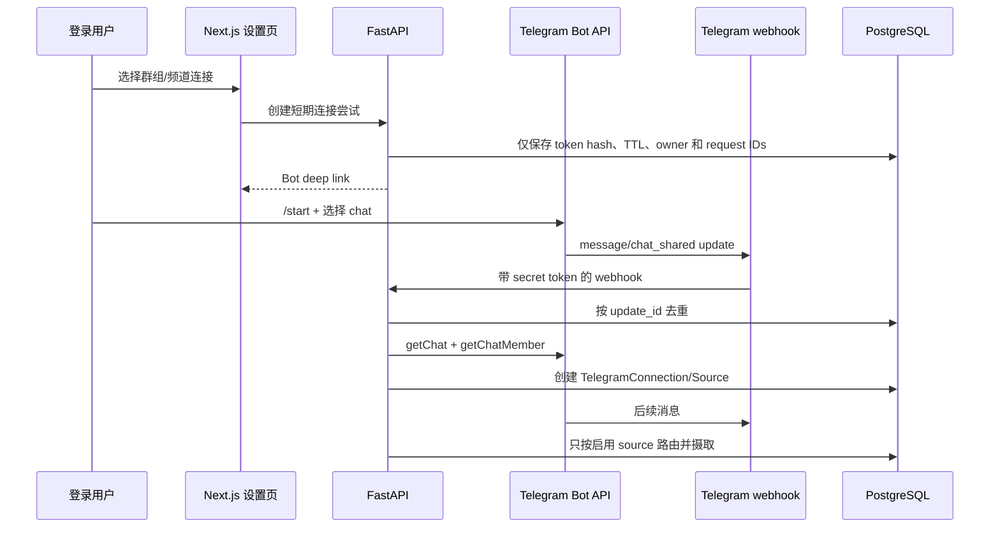

# 架构总览

> 状态：当前事实 · 最后核验：2026-07-11 · 代码真相源：`backend/app/`、`frontend/`

## 系统上下文

商机雷达把外部 IM 消息转换为可审核、可回复的商机。系统有四类边界：外部消息平台、Web
用户、AI 提供商和持久化/队列基础设施。

## 部署单元

| 单元 | 入口 | 职责 |
| --- | --- | --- |
| Frontend | `frontend/app/layout.tsx` | 认证上下文、商机看板、详情/SOP、设置与模板 UI |
| API | `backend/app/main.py` | FastAPI 路由、OAuth、查询/命令、webhook 接入 |
| Celery worker | `backend/app/worker/celery_app.py` | AI 回复与超时任务的异步执行 |
| Celery beat | 同上 | 周期调度待人工商机超时检查 |
| WeCom archive worker | `backend/app/worker/tasks.py` + Finance SDK | 单并发拉取/解密企业级会话存档，按成员 binding 生成只读消息与商机 |
| pi Agent runner | `backend/pi-agent-runtime/src/index.mjs` | 由 worker 按消息启动；只提交结构化分析，不持有业务动作权限 |
| Telegram listener | `backend/app/worker/telegram_listener.py` | 保持旧 MTProto session 的兼容监听 |
| Telegram QR worker / listener | `backend/app/worker/telegram_mtproto_qr_worker.py`、`telegram_mtproto_listener.py` | 平台凭据二维码登录、加密 session 与普通账号来源的只读监听 |
| PostgreSQL | SQLModel + Alembic | 用户、订阅/用量账本、消息、商机、规则、配置、模板、Telegram 配置 |
| Redis | DB 0/1/2 | 应用临时状态、Celery broker、Celery result backend |

本地编排见 `backend/docker-compose.yml`；生产镜像编排见
`backend/docker-compose.prod.yml`；GitHub Actions 构建和 VPS 部署见 `.github/workflows/`。
后端 Python 版本与直接依赖声明在 `backend/pyproject.toml`，`backend/uv.lock` 是跨平台精确锁；
本地、CI 和 Docker 均通过 uv 同步同一依赖图。

## 后端分层

项目是“实用型分层 + 领域端口”，并非严格的 Clean Architecture：application 当前可直接使用
SQLModel 实体和具体 repository。新增代码必须至少保持以下单向约束，不得进一步侵蚀内层。

### 层职责与禁区

- `domain/`：领域枚举、Protocol 端口、商机识别和状态迁移规则。不得导入 `api`、
  `application`、`infrastructure`、`worker` 或框架/数据库实现。
- `core/`：无业务编排的跨切面能力。不得依赖 API、application、infrastructure、worker。
- `infrastructure/`：端口适配器与持久化实现。不得依赖 API、application 或 worker。
- `application/`：用例、DTO 与映射。可协调现有基础设施，但不得依赖 API/worker。
- `api/`、`worker/`：组合根和传输适配层，可以组装上述模块；业务判断应下沉到用例或领域服务。

这些稳定禁区由 `scripts/harness_check.py` 解析 Python AST 检查。若要收紧成严格端口架构，先写
ADR 和迁移计划，不要在单个功能中半途改造。

## 核心数据模型

| 模型 | 作用 | 关键关系/约束 |
| --- | --- | --- |
| `User` / `AuthAccount` | 本地用户与 OAuth 身份 | provider + subject 唯一；`auth_version` 吊销旧 JWT；资源按 `user_id` 隔离 |
| `PasswordResetChallenge` | 一次性密码重置挑战 | 只存 token/code HMAC 摘要；用户、到期时间、失败次数和使用状态受约束 |
| `SubscriptionAccount` | 用户有效权益投影 | user 唯一；受限 API 的最终权限来源；旧 provider ID 字段仅兼容保留 |
| `BillingSubscription` / `BillingEvent` / `BillingProduct` | RevenueCat 渠道事实、幂等事件与产品映射审计 | 多渠道订阅；provider external key 与 event ID 唯一；不长期保存 raw webhook |
| `UsageLedger` | AI 功能额度的可审计账本 | user + feature + idempotency key 唯一；reserved/consumed/released |
| `Message` | 收发消息审计记录 | channel + external_message_id 幂等；保存 pi 分析状态/结果；可关联 opportunity |
| `Opportunity` / `OpportunityArchiveEvent` | 商机聚合根与归档审计 | 状态表达业务生命周期；nullable 归档字段独立控制看板可见性，恢复不改变状态；source_message 唯一 |
| `JobOpportunityDetail` / `JobOpportunitySource` | 工作机会结构化投影与来源证据 | opportunity 一对一详情；所有重复来源保留，来源链接与投递链接分离 |
| `SourceFunctionalProfile` / `JobMessageAudit` | 来源职能画像与消息分类审计 | owner + channel + source 唯一；人工覆盖优先；不保存完整 provider payload |
| `JobSearchProfile` / `JobOpportunityMatch` | 用户求职偏好与确定性匹配结果 | 多档案按 owner 隔离；受保护属性不进入档案或评分 |
| `AutoReplyDelivery` | AI 自动回复最小投递账本 | owner + idempotency key 唯一；记录门禁原因与发送状态，不复制正文或 provider raw response |
| `Rule` | 关键词/正则/AI hint 规则 | 启用、优先级、分数驱动检测策略 |
| `AppConfig` | 运行期业务配置 | JSONB value；当前包含工作时间等配置 |
| `ReplyTemplate` | 人工回复模板 | 可启用、分类 |
| `TelegramConnection` | 新版用户 Telegram 连接 | owner、连接类型、状态、能力和非明文凭据槽；不向 API 返回秘密 |
| `TelegramSource` | 连接下的群组/频道/私聊来源 | connection + external chat 唯一；按 owner、enabled 与 quota_paused 过滤 webhook |
| `TelegramConnectionAttempt` / `TelegramWebhookEvent` | 连接握手与 webhook 审计 | 仅保存连接令牌哈希/TTL；以 Telegram update ID 去重，不保存 raw webhook |
| `TelegramUserConfig` / `TelegramMonitor` | 旧 MTProto 兼容路径 | 既有加密 session 与 listener 保持可用，直到单独的迁移计划完成 |
| `WeComConnection` / `WeComWebhookEvent` | 企业微信自建应用连接与 webhook 幂等审计 | owner 管理、用户级加密凭据；只接收成员发给应用的消息 |
| `WeComArchiveConnection` / `WeComArchiveMemberBinding` | 企业级会话存档连接和本地用户可见性边界 | connection owner 只能管理连接；只有参与消息的 active binding 可获得投影 |
| `WeComArchiveCursor` / `WeComArchiveEvent` | Finance SDK 增量游标与最小事件审计 | connection 唯一 cursor、provider message ID 幂等；不复制完整 provider payload |

结构变更以 `backend/alembic/versions/` 的迁移历史为准；模型变更必须配套新迁移。

## 关键数据流

### 消息摄取与商机识别

商机归档是独立于状态机的可见性维度。默认列表和统计只查询未归档记录，归档区可读取并恢复原记录；
归档不删除 Message、不停止 Telegram/企微来源，也不改变 replied/following/closed 等业务状态。归档后
API 拒绝回复、分析、认领和状态更新，已排队的 SLA/AI 自动回复任务也会跳过，避免隐藏记录继续发送。
每次实际归档或恢复都写 `OpportunityArchiveEvent`，重复请求保持幂等。

- 高置信规则命中保持低延迟直通；其余非空消息在 `AI_ENABLED=true` 时均可进入语义复核，不再要求
  先达到关键词灰区分数。AI 关闭、输出非法或 provider 失败时回退到同一确定性规则结果。
- 语义复核最多使用当前 owner 同会话最近 6 条、合计 4000 字符的规范化历史；不传 raw payload、
  token 或 session。`AI_HINT` 规则既保留原匹配分数，也作为模型的领域正例提示。
- 语义模型新发现的商机始终进入 `PENDING_HUMAN`，即使处于非工作时间也不能直接触发自动回复；
  只有确定性规则识别路径继续遵循工作时间路由。

### 工作机会发现

工作机会是在同一 Message/Opportunity 聚合根上的 `opportunity_type=job` 投影。消息先根据缓存的来源
职能画像和确定性规则预筛，再复用现有 Celery、pi Agent Runtime 与 UsageLedger 完成分类和证据约束
提取；只有 `job_post`/`job_repost` 写正式职位。去重使用精确指纹和本地结构化特征相似度，匹配分由
纯 Python 领域服务计算，模型无权决定资格或覆盖分数。年龄、性别等显式限制只产生原文透明度和合规
提示，不进入用户档案或排序。完整边界见[工作机会发现架构](job-opportunity-discovery.md)。

### Telegram 原生连接

### pi Agent 消息后处理

- `PI_AGENT_ENABLED` 默认开启；显式设为 `false` 时摄取链路不启动 Node 或链接网络请求。开启但
  provider key 缺失时不入队并记录非敏感配置告警，不回退到匿名或 mock provider。
- worker 从 `agent` 队列领取 message ID；重复任务通过 Message 分析状态和 source message 唯一索引
  保持幂等，失败可重试。
- Python `SafeLinkInspector` 只读取公网 HTTP(S) 文本，逐跳检查重定向并限制端口、数量、时间、
  响应字节和传给模型的文本长度。网页内容与消息文本都作为不可信数据。
- Node runner 使用 `@earendil-works/pi-agent-core` 的无持久会话 Agent，不加载 coding-agent、
  context、skills 或内置工具；唯一工具 `submit_analysis` 用 TypeBox 验证最终结构并终止 loop。
- Python 再用 Pydantic 校验并执行确定性投影：链接读取器的风险不能被模型降级；邮件、好友申请、
  私信建议强制需要人工批准；内部重大商机提醒可以直接展示。
- Agent 高置信补判商机时只创建 `PENDING_HUMAN`，不能让模型把自己路由到自动回复。
- 自动分析使用 message 级幂等键，手工重跑接受 `Idempotency-Key`；两条路径都在 enqueue 前通过
  `SubscriptionRepository` 预留额度。worker 成功结算，最终失败释放；Free 使用 UTC 自然月，付费
  用户也始终使用 UTC 自然月 usage period；monthly/annual billing period 只描述续费和到期。无 owner
  消息不运行 Agent，也不占用任何用户额度。
- Telegram 配置读取和 listener 每次刷新都重新解析有效套餐；套餐到期后，按用户保留优先级启动
  额度内 monitor，超额项标记 `quota_paused` 而不删除。用户可在设置页重新选择保留群；选择写入当前
  retention limit，升级后优先级仍保留，未来再次降级可复用。
- 新版 Bot 来源与旧 MTProto monitor 在 Telegram 套餐额度中合计统计。新来源创建时先检查总额；
  webhook 只会摄取已启用且未被额度暂停的 `TelegramSource`。

### 统一订阅同步

- 三端登录后以 `users.id` UUID 绑定 RevenueCat，客户端购买成功只触发当前用户 `/subscriptions/sync`，
  不能提交 plan、entitlement 或 purchase token。
- RevenueCat webhook 在 JSON parse 前校验固定 Authorization、raw-body HMAC 与 timestamp，按 event ID
  幂等落库后交 Celery。worker 总是重新查询 Customer，再在一个事务中更新渠道记录与权益投影。
- 同时存在多个渠道时取 `max > pro > plus > free`，投影标记重复付费；不会自动取消、退款或迁移。
- provider 网络失败不写 Free 覆盖快照。每日 reconcile 修复漏事件；降级只暂停超额 Source，不删数据。

### 回复

- 人工回复：API → `ManualReplyUseCase` → IM adapter 发送 → 创建 outgoing `Message` → 状态
  进入 `FOLLOWING` 或 `REPLIED`。
- AI 草稿：API → `AIDraftUseCase` → `LiteLLMReplyGenerator` → 保存 `ai_reply_draft`，不发送。
- AI 自动回复：摄取只创建候选并先运行 pi Agent；分析成功后 Celery 才进入 `AIAutoReplyUseCase`。
  纯 Python 策略重新检查服务端安全阀、用户日程、Telegram Business 私聊来源授权、风险、置信度、
  冷却期和草稿内容，再通过 `AutoReplyDelivery` 执行 at-most-once 投递。
- 群组、频道、MTProto 普通账号、企业微信和 Agent 补判商机不能进入自动发送。任何未知/失败条件
  转为 `PENDING_HUMAN`；旧 SLA sweep 只触发审核提醒，不再升级为自动发送。
- `IM_SEND_ENABLED` 与 `AI_AUTO_REPLY_ENABLED` 默认开启，但仍分别是总发送阀和自动回复功能阀；任一
  显式关闭均不得自动发送。真实资格还需用户日程与来源双重授权。adapter 的 dry-run 回执不创建
  outgoing Message，也不把商机标记为 `REPLIED`。

### 密码修改与邮箱重置

- 忘记密码 API 先按客户端与邮箱摘要在 Redis 限流，再始终投递同一种 Celery 任务；worker 才查询用户，
  避免 HTTP 路径通过账户存在性分叉。
- worker 为有效用户创建短时挑战并通过 SMTP 发送高熵链接 token 与移动端验证码；数据库只保存使用
  `JWT_SECRET_KEY` HMAC 后的摘要。新挑战使旧挑战失效，成功后消费该用户全部未使用挑战。
- 已有密码用户修改时必须验证当前 PBKDF2 hash；OAuth 无密码用户必须走邮箱验证。
- 成功修改或重置递增 `users.auth_version`。JWT 携带签发时版本，`require_user` 每次与数据库对比，
  因此 Web、iOS、Android 的旧会话都会收到 401 并回到登录页。

## 前端结构与状态边界

- App Router 页面位于 `frontend/app/`，复用组件位于 `frontend/components/`，基础 UI 在
  `frontend/components/ui/`。
- `AuthProvider` 负责 localStorage token 与 `/auth/me` 恢复；`AppStoreProvider` 当前混合后端
  数据与演示态本地状态。
- `frontend/lib/api.ts` 是 HTTP 访问边界，`frontend/lib/types.ts` 是前端契约。后端字段变化
  必须从 DTO → API client → types → UI 连贯更新。
- 生产功能不得继续扩大 `AppStoreProvider` 中的 timer/mock 状态；新增真实能力应先补 API client，
  再把 UI action 接到后端并处理 loading/error/rollback。

## 主要不变量

- 外部消息摄取按平台消息 ID 幂等。
- 用户查询与 Telegram 配置必须按当前认证用户隔离。
- 商机状态只能走 `domain/services/opportunity_state.py` 允许的迁移。
- 外部 payload 在传输/适配器边界解析；领域规则只接收规范化数据。
- 发送成功后要记录 outgoing Message；失败不得伪造已回复状态。
- Agent 外部动作只是建议；未经过独立审批用例不得调用 IM/邮件/好友适配器。
- URL 分析拒绝本机、私网、link-local 和保留地址；生产还应使用受控 egress 降低 DNS rebinding 风险。
- 时间均使用带时区 datetime；业务工作时间默认 `Asia/Shanghai`，可由配置覆盖。
- 秘密只来自环境或加密字段，日志和 API 响应不得暴露 token、session、api_hash。
