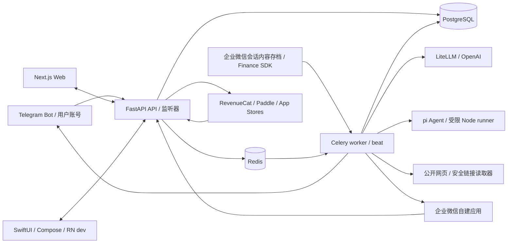
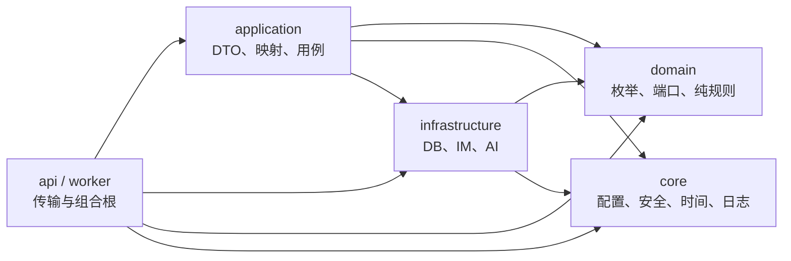
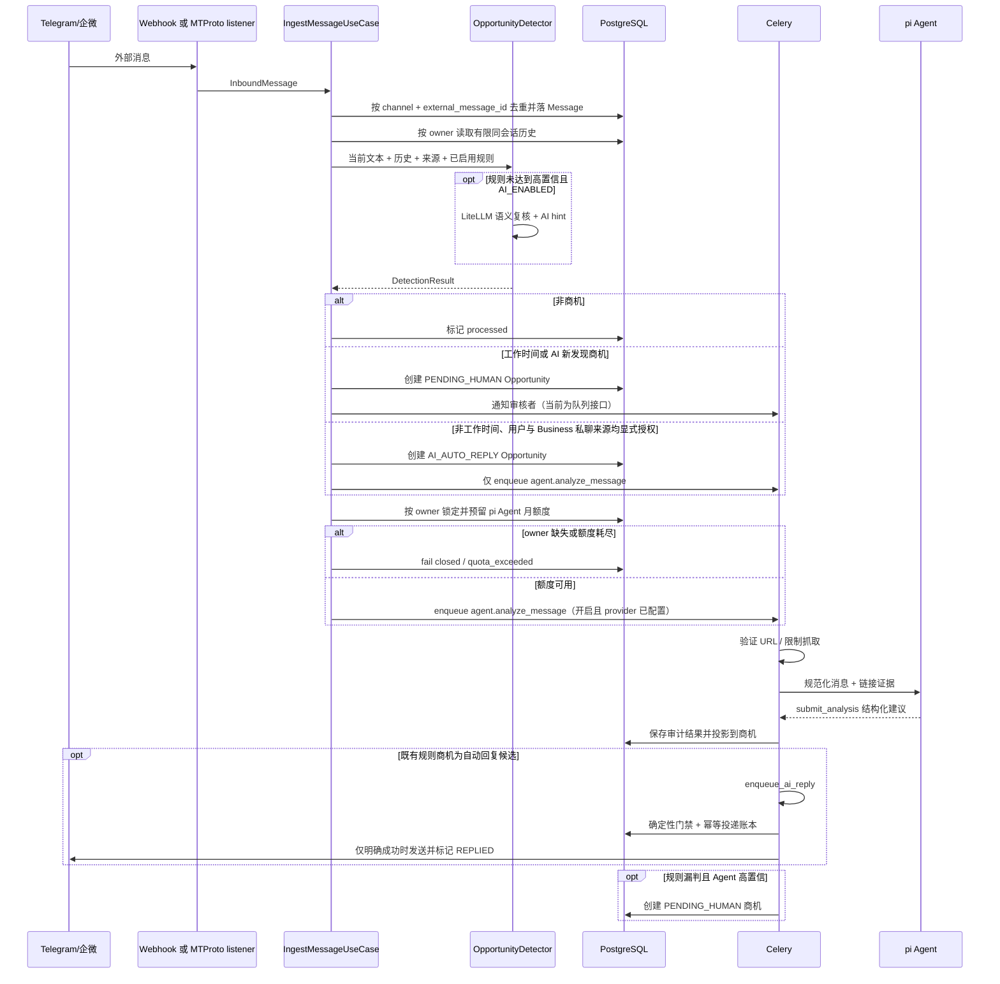
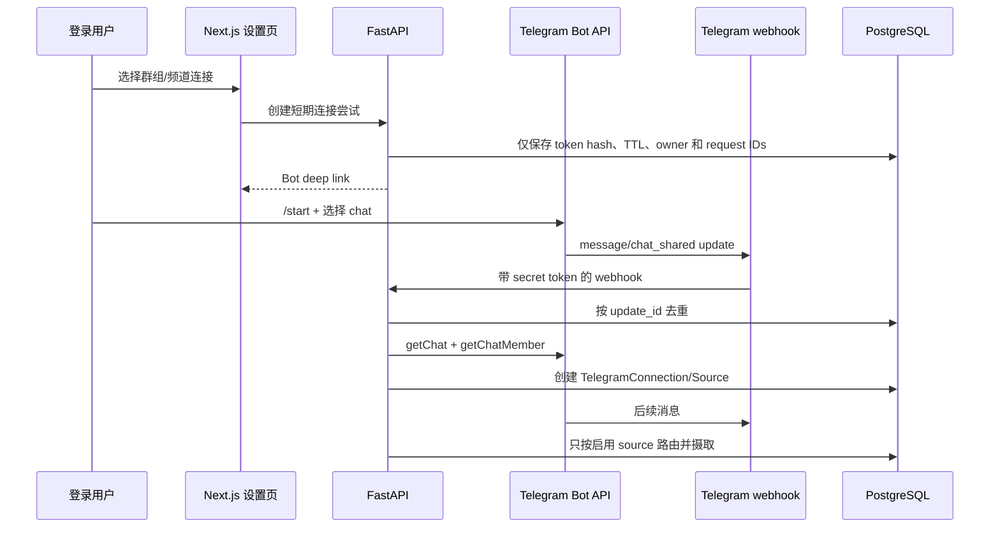

# 架构总览

> 状态：当前事实 · 最后核验：2026-07-17 · 代码真相源：`backend/app/`、`frontend/`、`packages/`、`mobile/radar/`

## 系统上下文

商机雷达把外部 IM 消息转换为可审核、可回复的商机。系统有四类边界：外部消息平台、Web
用户、AI 提供商和持久化/队列基础设施。

## 部署单元

| 单元 | 入口 | 职责 |
| --- | --- | --- |
| Frontend | `frontend/app/layout.tsx` | 认证上下文、商机看板、详情/SOP、设置与模板 UI |
| API | `backend/app/main.py` | FastAPI 路由、OAuth、查询/命令、webhook 接入 |
| Celery worker | `backend/app/worker/celery_app.py` | AI 回复与超时任务的异步执行 |
| Celery beat | 同上 | 周期调度待人工商机超时检查 |
| WeCom archive worker | `backend/app/worker/tasks.py` + Finance SDK | 单并发拉取/解密企业级会话存档，按成员 binding 生成只读消息与商机 |
| pi Agent runner | `backend/pi-agent-runtime/src/index.mjs` | 由 worker 按消息启动；只提交结构化分析，不持有业务动作权限 |
| RN P0-P2 开发包 | `mobile/radar/app/` | 独立 dev bundle id 的认证、在线看板、详情/消息、人工回复、AI 草稿、模板、认领与状态流转，共享包接入及兼容性实验；尚未替代商店原生 App，默认不配置生产 API |
| 共享 TypeScript | `packages/radar-*` | OpenAPI 类型、纯 core、跨平台 API client 与 Agent schema/prompt；使用直接子路径导出 |
| Telegram listener | `backend/app/worker/telegram_listener.py` | 保持旧 MTProto session 的兼容监听 |
| Telegram QR worker / listener | `backend/app/worker/telegram_mtproto_qr_worker.py`、`telegram_mtproto_listener.py` | 平台凭据二维码登录、加密 session 与普通账号来源的只读监听 |
| PostgreSQL | SQLModel + Alembic | 用户、订阅/用量账本、消息、商机、规则、配置、模板、Telegram 配置 |
| Redis | DB 0/1/2 | 应用临时状态、Celery broker、Celery result backend |

本地编排见 `backend/docker-compose.yml`；生产镜像编排见
`backend/docker-compose.prod.yml`；GitHub Actions 构建和 VPS 部署见 `.github/workflows/`。
后端 Python 版本与直接依赖声明在 `backend/pyproject.toml`，`backend/uv.lock` 是跨平台精确锁；
本地、CI 和 Docker 均通过 uv 同步同一依赖图。

Web、RN 与 `packages/*` 由根 `pnpm-workspace.yaml` 和唯一根 `pnpm-lock.yaml` 管理；Node runner 因
Docker/子进程边界继续使用 `backend/pi-agent-runtime/package-lock.json`，通过受审查的 `file:` 依赖消费
`packages/radar-agent`。FastAPI OpenAPI snapshot 是 TypeScript API 契约源，CI 同时检查 Python snapshot
与生成文件漂移。

RN 启动时并行恢复 SecureStore 会话和迁移本地 `radar.db`。当前 SQLite v5 建立按 `owner_id` 隔离的原始
change inbox、商机/消息/三类设置 projection、可恢复 bootstrap 状态、幂等 command outbox、sync cursor
与最后一次服务端 capability 决策，并为端上分析保存有界 input、lease/lock/version/phase/attempt 等最小
恢复状态；另以应用自定义、版本化 entry 保存 30 天交互式 Agent 本地会话。分析 run token 可使用
SecureStore 恢复；交互 turn token 与一次性外发 approval token 只驻留当前运行内存，token/password
不进入 SQLite。
只有明确 401 才清凭据，网络失败保留并 fail closed。登录后后台注册 installation，服务端只保存 HMAC；
device ID/refresh bearer 先写入并回读验证，再原子替换 access token。启动时 access 失效会用单次 refresh
轮换恢复，旧 bearer 复用撤销整个设备 family；登出先尽力撤销设备再清 legacy/current/device 凭据。

P3 服务端已为 Message、Opportunity 和三类用户设置增加 `aggregate_version`。ORM `before_flush` 只对这些
聚合捕获公开投影，在同一业务事务追加 owner-scoped upsert/tombstone；不会把现有多次 commit 合并成虚假
领域事件，也不会把 IM provider raw payload 放进同步流。`GET /sync/bootstrap` 以 owner 绑定的签名 token
分页当前快照，`GET /sync/changes` 返回按 cursor 严格递增的最多 500 条 change；默认 30 天窗口之外或客户端
超前均显式要求 reset。`POST /sync/ack` 只接受带 `did` 的 active 设备 access token，并单调记录设备已应用
cursor/错误码。外部回复依赖在线确认，因此全局回复模板不是首批离线快照的必要数据，仍从在线模板 API 读。

RN 已在单个 SQLite 事务中写 change inbox、按 aggregate version 幂等更新 projection 并推进 cursor；支持
分页 bootstrap 断点、过期 token 重启、cursor reset、逻辑投影损坏后强制重建和 best-effort ack。设备上报
`client.reactNative=true`/`sqlite.schema=5`，并如实报告 `agent.submitAnalysis=true`、
`agent.streaming=true`、`agent.runtime=pi-0.80.6`、`agent.schema=1`、`agent.interactive=true` 与
`agent.interactiveSchema=3`（表示客户端最高支持版本，服务端仍可选择 v1/v2）；
`GET /devices/current/capabilities` 仍要求 active `did` 会话和
服务端 `RN_SYNC_ROLLOUT_ENABLED` 才返回 `syncAvailable=true`。启动、前台恢复、手动刷新，以及
`expo-network` 确认的离线到在线转换都会触发同一个 single-flight 同步和 outbox drain；网络监听直接订阅
原生事件，不把高频状态广播进 React Provider 树。看板、详情、消息与设置保持 online-first，只在
capability 已授权且网络/5xx 失败时读取 ready 的本地投影。401、校验错误、严格契约错误和取消请求不回退。
灰度开关默认关闭，真机飞行模式证据完成前生产仍返回 `syncAvailable=false`。

离线 outbox 当前只接受不触发外部副作用的 `opportunity_status`。命令固定携带 owner、aggregate、SQLite
projection base version、7 天过期时间和稳定幂等键；单 owner 最多 100 条 active、单次前台 drain 最多
50 条、最多尝试 5 次。恢复联网时先同步服务端变更，再比较本地版本、提交命令，成功后再同步一次投影。
服务端在商机行锁事务内检查 `expectedVersion`，并写 owner 级 `InternalCommandReceipt`；回执和状态变更/
SyncChange 原子提交，30 天后可清理。响应不确定时客户端沿用同一键，409/过期/拒绝进入看板可打开、
可忽略的用户可见队列。人工回复、好友申请、认领、AI 草稿等仍是显式在线动作，不进入 outbox。

P3 推送采用“已提交 change feed 的 cursor 提示”，不是数据通道。RN 仅在用户显式授权后通过
`expo-notifications` 取得原生 APNs/FCM token；服务端加密 token、以 SHA-256 hash 去重，并按设备、provider
和环境管理轮换/撤销。Celery beat 扫描每个 active registration 尚未提示的 owner 最新 cursor，先写短租约再
调用可替换的 APNs/FCM v1 adapter；成功推进 `last_notified_cursor`，平台报告未注册则永久失效，暂时故障指数
退避。payload 只有版本化 cursor 和 APNs `content-available`/FCM data 元数据，没有标题、正文、商机 ID 或
消息内容。前台 listener、点击冷启动和已注册 background task 都只触发同一个 single-flight sync；提示
cursor 不领先于本地 durable cursor 时跳过重复拉取，本地落后、缺失或读取失败时仍走正常恢复。OS 丢弃
推送时，App 启动、前台恢复、网络恢复和手动刷新仍补拉 change。设备注册同时上报签名实际对应的
`push.environment`；服务端只在该环境的 provider/topic 可用时接受 token。`RN_SYNC_ROLLOUT_ENABLED`、
`RN_PUSH_ROLLOUT_ENABLED`、provider 凭据、环境与客户端 schema 任一不满足时
`pushAvailable=false`。

RN 看板优先读取服务端 `GET /opportunities/dashboard`，服务端负责 owner 隔离、筛选、排序、分页和
重大商机聚合；共享 `radar-api` 在客户端使用严格 runtime decoder，AbortController 与 request key 防止
过期请求覆盖新筛选。服务端 capability 开启后，网络/5xx 失败可用相同查询语义读取 SQLite projection；
在线 REST 响应本身不会被客户端伪写成同步真相。

RN P2 详情按 UUID 深链独立并行读取 `GET /opportunities/{id}` 与第一页
`GET /messages/page`，后续消息按 20 条继续分页；Web 详情也消费相同严格 API，并按 200 条分页。
服务端分页硬上限为 200，未知或非 owner 的消息资源返回空页以隐藏存在性；旧 SwiftUI/Compose
数组端点继续可用，但只返回最近 500 条并恢复为时间正序。详情与消息由 change feed 写入 SQLite；开启
capability 后只读请求可离线回退，归档和回复等写操作仍必须在线，历史详情与消息仍可读取。

RN/Web 的在线写操作共用 `packages/radar-api` 的严格子路径 API。人工回复由客户端生成稳定 UUID
`Idempotency-Key`，失败重试不换键；响应直接携带服务端商机、outgoing Message 与精确消息总数，客户端
不会合成临时时间戳 ID。认领和状态流转只使用服务端返回的行锁结果；AI 端点只返回可编辑草稿，模板
列表为空或失败时不回退 mock。上述能力仍是在线 REST，P3 前不把写命令放进 SQLite outbox。

## 后端分层

项目是“实用型分层 + 领域端口”，并非严格的 Clean Architecture：application 当前可直接使用
SQLModel 实体和具体 repository。新增代码必须至少保持以下单向约束，不得进一步侵蚀内层。

### 层职责与禁区

- `domain/`：领域枚举、Protocol 端口、商机识别和状态迁移规则。不得导入 `api`、
  `application`、`infrastructure`、`worker` 或框架/数据库实现。
- `core/`：无业务编排的跨切面能力。不得依赖 API、application、infrastructure、worker。
- `infrastructure/`：端口适配器与持久化实现。不得依赖 API、application 或 worker。
- `application/`：用例、DTO 与映射。可协调现有基础设施，但不得依赖 API/worker。
- `api/`、`worker/`：组合根和传输适配层，可以组装上述模块；业务判断应下沉到用例或领域服务。

这些稳定禁区由 `scripts/harness_check.py` 解析 Python AST 检查。若要收紧成严格端口架构，先写
ADR 和迁移计划，不要在单个功能中半途改造。

## 核心数据模型

| 模型 | 作用 | 关键关系/约束 |
| --- | --- | --- |
| `User` / `AuthAccount` | 本地用户与 OAuth 身份 | provider + subject 唯一；资源按 `user_id` 隔离 |
| `Device` / `DeviceCredential` | P3 可撤销移动安装与轮换凭据 | owner + installation HMAC 唯一；owner/device 复合外键；refresh bearer 仅存 SHA-256 hash；单设备最多一个 active credential；注册、列表、撤销和单次轮换 API 已开放，旧 bearer 复用会撤销设备 family |
| `PushRegistration` | P3 APNs/FCM token 生命周期与 cursor 提示进度 | 平台必要 token 加密、hash 去重；单设备/provider/environment 最多一个 active；轮换/撤销/平台失效；短租约、失败退避和 `last_notified_cursor` 防止稳定重复投递 |
| `SyncChange` | P3 owner-scoped aggregate upsert/tombstone feed | 全局 BIGINT identity 使每个 owner 子序列单调；aggregate version 唯一、payload/operation 受约束；Message/Opportunity/三类设置事务内 append 与 bounded bootstrap/changes/reset/ack API 已开放，RN 已实现事务化消费与 capability 门控的只读回退，生产灰度仍默认关闭 |
| `InternalCommandReceipt` | P3 内部离线状态命令幂等回执 | owner + idempotency key 唯一；绑定商机、base version 和 payload hash；与商机状态/SyncChange 同事务，默认保留 30 天；不承载任何外部 IM 动作 |
| `SubscriptionAccount` | 用户有效权益投影 | user 唯一；受限 API 的最终权限来源；旧 provider ID 字段仅兼容保留 |
| `BillingSubscription` / `BillingEvent` / `BillingProduct` | RevenueCat 渠道事实、幂等事件与产品映射审计 | 多渠道订阅；provider external key 与 event ID 唯一；不长期保存 raw webhook |
| `UsageLedger` | AI 功能额度的可审计账本 | user + feature + idempotency key 唯一；reserved/consumed/released |
| `AnalysisRun` / `AnalysisProviderRequest` | P4 设备分析租约、shadow 观察、唯一投影和无正文 provider 成本审计 | owner/device/message/ledger 复合约束；同消息最多一个 active run 和一个 shadow run、同 run 最多一个 active provider stream；run token 只存 nonce hash，provider request ID 只存 SHA-256；shadow 只记录 match/difference，不写业务投影 |
| `Message` | 收发消息审计记录 | channel + external_message_id 幂等；保存 pi 分析状态/结果及无正文执行来源（server/device、run/device、runtime/schema/model/policy）；可关联 opportunity |
| `Opportunity` / `OpportunityArchiveEvent` | 商机聚合根与归档审计 | 状态表达业务生命周期；nullable 归档字段独立控制看板可见性，恢复不改变状态；source_message 唯一 |
| `ManualReplyDelivery` | 跨 IM 适配器的人工外发投递账本 | owner + idempotency key 唯一；绑定商机/正文哈希，记录 PENDING/SENDING/DELIVERED/COMPLETED/FAILED/UNCERTAIN 与 provider message ID；结果不确定时禁止自动重发 |
| `InteractiveAgentActionApproval` | P5 单次交互 Agent 外发批准证明 | owner/device/turn/tool-call 唯一；只保存 canonical args SHA-256、资源版本、幂等键、nonce hash 与生命周期，不保存正文/token；GRANTED 只能 claim 一次，终态不可回退 |
| `Rule` | 关键词/正则/AI hint 规则 | 启用、优先级、分数驱动检测策略 |
| `AppConfig` | 运行期业务配置 | JSONB value；当前包含工作时间等配置 |
| `ReplyTemplate` | 人工回复模板 | 可启用、分类 |
| `TelegramConnection` | 新版用户 Telegram 连接 | owner、连接类型、状态、能力和非明文凭据槽；不向 API 返回秘密 |
| `TelegramSource` | 连接下的群组/频道/私聊来源 | connection + external chat 唯一；按 owner、enabled 与 quota_paused 过滤 webhook |
| `TelegramConnectionAttempt` / `TelegramWebhookEvent` | 连接握手与 webhook 审计 | 仅保存连接令牌哈希/TTL；以 Telegram update ID 去重，不保存 raw webhook |
| `TelegramUserConfig` / `TelegramMonitor` | 旧 MTProto 兼容路径 | 既有加密 session 与 listener 保持可用，直到单独的迁移计划完成 |
| `WeComConnection` / `WeComWebhookEvent` | 企业微信自建应用连接与 webhook 幂等审计 | owner 管理、用户级加密凭据；只接收成员发给应用的消息 |
| `WeComArchiveConnection` / `WeComArchiveMemberBinding` | 企业级会话存档连接和本地用户可见性边界 | connection owner 只能管理连接；只有参与消息的 active binding 可获得投影 |
| `WeComArchiveCursor` / `WeComArchiveEvent` | Finance SDK 增量游标与最小事件审计 | connection 唯一 cursor、provider message ID 幂等；不复制完整 provider payload |

结构变更以 `backend/alembic/versions/` 的迁移历史为准；模型变更必须配套新迁移。

## 关键数据流

### 消息摄取与商机识别

商机归档是独立于状态机的可见性维度。默认列表和统计只查询未归档记录，归档区可读取并恢复原记录；
归档不删除 Message、不停止 Telegram/企微来源，也不改变 replied/following/closed 等业务状态。归档后
API 拒绝回复、分析、认领和状态更新，已排队的 SLA/AI 自动回复任务也会跳过，避免隐藏记录继续发送。
每次实际归档或恢复都写 `OpportunityArchiveEvent`，重复请求保持幂等。

- 高置信规则命中保持低延迟直通；其余非空消息在 `AI_ENABLED=true` 时均可进入语义复核，不再要求
  先达到关键词灰区分数。AI 关闭、输出非法或 provider 失败时回退到同一确定性规则结果。
- 语义复核最多使用当前 owner 同会话最近 6 条、合计 4000 字符的规范化历史；不传 raw payload、
  token 或 session。`AI_HINT` 规则既保留原匹配分数，也作为模型的领域正例提示。
- 语义模型新发现的商机始终进入 `PENDING_HUMAN`，即使处于非工作时间也不能直接触发自动回复；
  只有确定性规则识别路径继续遵循工作时间路由。

### 工作机会发现

工作机会是在同一 Message/Opportunity 聚合根上的 `opportunity_type=job` 投影。消息先根据缓存的来源
职能画像和确定性规则预筛，再复用现有 Celery、pi Agent Runtime 与 UsageLedger 完成分类和证据约束
提取；只有 `job_post`/`job_repost` 写正式职位。去重使用精确指纹和本地结构化特征相似度，匹配分由
纯 Python 领域服务计算，模型无权决定资格或覆盖分数。年龄、性别等显式限制只产生原文透明度和合规
提示，不进入用户档案或排序。完整边界见[工作机会发现架构](job-opportunity-discovery.md)。

### Telegram 原生连接

### pi Agent 消息后处理

- `PI_AGENT_ENABLED` 默认开启；显式设为 `false` 时摄取链路不启动 Node 或链接网络请求。开启但
  provider key 缺失时不入队并记录非敏感配置告警，不回退到匿名或 mock provider。
- worker 从 `agent` 队列领取 message ID；重复任务通过 Message 分析状态和 source message 唯一索引
  保持幂等，失败可重试。
- Python `SafeLinkInspector` 只读取公网 HTTP(S) 文本，逐跳检查重定向并限制端口、数量、时间、
  响应字节和传给模型的文本长度。网页内容与消息文本都作为不可信数据。
- Node runner 与 RN 使用 `@earendil-works/pi-agent-core` 的无持久会话 Agent，不加载 coding-agent、
  context、skills 或内置工具；唯一工具 `submit_analysis` 用 `packages/radar-agent` 的共享 TypeBox schema
  验证最终结构并终止 loop。RN 的自定义 stream adapter 只把首次 system/user + 单工具请求发送到受限
  网关，拒绝额外消息历史、工具、prose 或非结构化结束；provider key/真实 model 不进入 App。
- Python 再用 Pydantic 校验并执行确定性投影：链接读取器的风险不能被模型降级；邮件、好友申请、
  私信建议强制需要人工批准；内部重大商机提醒可以直接展示。
- Agent 高置信补判商机时只创建 `PENDING_HUMAN`，不能让模型把自己路由到自动回复。
- 自动分析使用 message 级幂等键，手工重跑接受 `Idempotency-Key`；两条路径都在 enqueue 前通过
  `SubscriptionRepository` 预留额度。worker 成功结算，最终失败释放；Free 使用 UTC 自然月，付费
  用户也始终使用 UTC 自然月 usage period；monthly/annual billing period 只描述续费和到期。无 owner
  消息不运行 Agent，也不占用任何用户额度。
- P4 已增加默认关闭的设备分析运行基础：active、owner-bound 且精确上报 RN/runtime/schema/streaming
  capability 的设备可在 rollout 开启后 claim 一条消息；`AnalysisRun` 以 PostgreSQL 行锁、active 唯一
  索引和短期 purpose JWT 管理 lease/heartbeat/complete/fail/expire。顶层运行复用一条
  `usage_ledger`，complete 仍由服务端 Pydantic 与 `project_agent_result` 二次钳制后才 consume，失败或
  过期 release。设备撤销会立即让尚未过期的 run token 失效。
- 同一开关域内另有默认关闭的 `/api/v1/agent/gateway/v1/chat/completions`：只接受有效 run token、固定
  model alias、两条受限消息和单一 `submit_analysis` 工具；服务端替换真实 provider model/key，强制
  `store=false`、tool choice、输出 token、请求/响应字节、超时、并发和每 run 请求上限。SSE 只返回
  alias 与网关生成 ID，不透传 provider model、request ID、fingerprint 或错误正文；取消会关闭上游流。
  `AnalysisProviderRequest` 只记录 provider/model、哈希后的 request ID、token、估算成本和延迟，不保存
  prompt/响应，且不新增用户 usage。
- 链接证据由 run token 绑定的 `POST /agent/runs/{id}/links/inspect` 生成：URL 只从服务端当前 Message
  派生，客户端请求体不能提交 URL；`SafeLinkInspector` 逐跳执行 SSRF/端口/DNS/重定向/类型/大小/超时
  限制并把有界证据缓存到 run。带链接的 run 在证据缺失时拒绝 complete，确定性风险仍可覆盖模型判断。
- RN SQLite v5 保存恢复所需的最小 run/input 元数据，短期 bearer 只进 device-only SecureStore；claim 后
  先持久化再运行，模型流期间续租，complete/fail/expire 后清理。App 退后台会取消 fetch/Agent 并保留
  run，回前台或网络恢复后重试；连续三次结构化执行失败才显式 fail，租约过期由服务端释放。恢复本地
  run 后，客户端在同步/推送 cursor 收敛后先通过 `claim-next` 领取一条 primary 候选；没有候选时最多
  领取一条服务端已完成结果的 shadow。shadow 可在 primary rollout 关闭时独立运行，复用既有 consumed ledger，只比较
  服务端钳制后的投影并记录差异，不二次投影或扣额。primary run 失败/过期先 release 原 reservation，再以
  稳定幂等键预留并入队既有 Celery runner；beat 周期回收失联 lease。
- primary 调度默认关闭。开启后只选择最近活跃、精确 capability 匹配且进入 owner/device 稳定哈希百分比
  cohort 或白名单的设备；全局门槛只统计当前 runtime/schema/model/policy 组合的近期 shadow 终态样本，
  检查样本量、成功率、一致率和 P95。合格时同一条 Celery job 延迟领取窗口执行，否则即时执行；消息锁、
  active run 检查、同消息 active reservation 唯一索引和 ledger 锁保证陈旧 worker 不能接管、标失败、
  release 或二次投影。管理员 readiness API 只返回聚合计数、比例、时延和原因，不返回消息或模型正文。
  当前仍只有 fake SSE 与双平台 Hermes
  production export 证据；真实 provider、系统 kill 后的双真机运行态及按设备灰度门禁未完成，因此
  production capability、shadow 和 fallback 开关仍为 false。
- P5 已增加独立的内部交互 Agent。`interactive_agent_turn` 顶层 turn 使用独立 usage feature，和
  `pi_agent_analysis` 不混扣；claim/heartbeat/complete/fail/expire 以 owner/device/本地 session/nonce/
  lease/lock 约束，并由 beat 回收失联 reservation。provider request 只保存模型、token、成本、延迟与
  终态审计，不保存对话、工具参数、工具结果或 provider 正文。
- `/api/v1/agent/interactive/gateway/v1/chat/completions` 只接受 purpose turn token、固定 alias/system
  prompt 与服务端为 turn 选择的精确 schema/policy 工具集。v1 只有共享的 `search_opportunities`、
  `get_opportunity`、`get_messages`；v2 只再增加 `draft_reply`、`update_status`、`claim_opportunity`；v3
  只再增加 `send_reply(opportunity_id,text)`。工具参数不接受 token、owner、版本、幂等键、channel 或
  `mark_following`；未审核的版本组合、普通 JWT、任意模型/工具、owner 参数及 HTTP/文件/SQL 均被拒绝。
- RN 只在用户提交时加载 pi host，owner 从认证 session 注入。`draft_reply` 重新校验本地 active projection，
  只把模型生成的 1–4000 字草稿写入本地会话且明确 `sent=false`；`update_status` 复用版本绑定、7 天过期、
  稳定幂等键的 SQLite command outbox 并只返回 `queued`；`claim_opportunity` 复用认证、owner-bound 的在线
  行锁 API 并只返回最小确认结果。流式文本停留在局部组件状态，最终应用 entry 批量写 SQLite，真实本地
  结果落盘后才确认服务端 turn 完成。server gateway 流经正文但不记录正文。
- v3 `send_reply` 先在 `beforeToolCall` 暂停。RN 从 owner-scoped SQLite 重新读取 active 商机及版本，审批卡
  展示目标、渠道、完整可编辑正文、外发风险和 2 分钟有效期。用户编辑值由 turn token 提交决定端点；服务端
  只落无正文 hash 审计并为 GRANTED 返回独立 purpose approval token。token 仅保存在 tool-call closure，
  首次执行尝试前即删除；执行 API 再检查 active device/turn、nonce、exact args hash、资源版本、状态、归档、
  adapter、`INTERACTIVE_AGENT_EXTERNAL_ACTIONS_ENABLED` 与 `IM_SEND_ENABLED`，然后复用
  `ManualReplyDelivery`。provider 结果不确定时批准和投递账本都冻结为不可自动重试状态。
- `agentToolsAvailable` 默认 false，只有 beta/gateway、正数独立额度、active allowlisted device、SQLite v5、
  精确 runtime/streaming 与“客户端最高 schema ≥ 服务端选择 schema”全部满足才显示 Agent Tab；schema 与
  policy 必须是 `1:interactive-read-only-v1`、`2:interactive-internal-v2` 或
  `3:interactive-approved-send-v3` 的成对配置。v3 还强制两个外发开关同时开启；关闭任一门禁会阻止批准和
  执行。已有本地会话保留到用户删除、登出清理或 30 天过期。生产默认仍为 v1 且所有开关关闭；记忆与
  跨设备会话尚未开放，真实 IM 沙箱和双真机外发仍是上线前证据。
- Telegram 配置读取和 listener 每次刷新都重新解析有效套餐；套餐到期后，按用户保留优先级启动
  额度内 monitor，超额项标记 `quota_paused` 而不删除。用户可在设置页重新选择保留群；选择写入当前
  retention limit，升级后优先级仍保留，未来再次降级可复用。
- 新版 Bot 来源与旧 MTProto monitor 在 Telegram 套餐额度中合计统计。新来源创建时先检查总额；
  webhook 只会摄取已启用且未被额度暂停的 `TelegramSource`。

### 统一订阅同步

- 三端登录后以 `users.id` UUID 绑定 RevenueCat，客户端购买成功只触发当前用户 `/subscriptions/sync`，
  不能提交 plan、entitlement 或 purchase token。
- RevenueCat webhook 在 JSON parse 前校验固定 Authorization、raw-body HMAC 与 timestamp，按 event ID
  幂等落库后交 Celery。worker 总是重新查询 Customer，再在一个事务中更新渠道记录与权益投影。
- 同时存在多个渠道时取 `max > pro > plus > free`，投影标记重复付费；不会自动取消、退款或迁移。
- provider 网络失败不写 Free 覆盖快照。每日 reconcile 修复漏事件；降级只暂停超额 Source，不删数据。

### 回复

- 人工回复：API 先在 `ManualReplyDelivery` 预留 owner-scoped 幂等键并原子认领发送权，再调用 IM
  adapter。provider 成功后标记 `DELIVERED`，随后以投递 UUID 作为稳定外部消息 ID 创建 outgoing
  `Message` 并把状态推进到 `FOLLOWING` 或 `REPLIED`，最后标记 `COMPLETED`。同键同请求只恢复投影，
  同键异文/商机返回 409；`SENDING` 并发请求返回 409；provider 结果不确定记为 `UNCERTAIN` 并返回
  502，同一键不得自动重发。`IM_SEND_ENABLED=false` 记为可重试 `FAILED`、返回 503，不创建消息或状态。
- 新客户端调用 `/manual-reply/result`，必须提供 8-128 字符幂等键，并接收服务端商机、outgoing
  Message 和精确 `messageTotal`；旧 `/manual-reply` 响应仍兼容，未带键时仅为旧客户端生成一次性键。
- AI 草稿：API → `AIDraftUseCase` → `LiteLLMReplyGenerator` → 保存 `ai_reply_draft`，不发送。
  生成未启用、provider 异常或输出非法时显式 503，不返回固定假草稿。
- AI 自动回复：Celery → `AIAutoReplyUseCase` → 生成/复用草稿 → IM adapter 发送 → 记录消息 →
  状态进入 `REPLIED`。
- `IM_SEND_ENABLED=false` 是本地安全阀；Telegram/企微适配器必须抛出显式禁用错误，不得返回
  `dry_run` 成功或绕过它执行真实发送。

## 前端结构与状态边界

- App Router 页面位于 `frontend/app/`，复用组件位于 `frontend/components/`，基础 UI 在
  `frontend/components/ui/`。
- `AuthProvider` 负责 localStorage token 与 `/auth/me` 恢复；`AppStoreProvider` 保存 Web 当前内存视图，
  但回复、AI 草稿、认领、状态和 SOP 关闭均调用真实服务端动作并以返回值更新，不再用 timer 或合成消息
  模拟成功。
- `frontend/lib/api.ts` 是 Web 适配边界；auth、看板、详情、消息、人工回复、AI 草稿、状态、认领和模板
  已迁移到 `packages/radar-api` 的直接子路径导出与严格 runtime decoder。`frontend/lib/types.ts` 仍保留 UI
  适配类型。后端字段变化必须从 DTO → OpenAPI snapshot/generated types → shared API → UI 连贯更新。
- 生产功能不得继续扩大 `AppStoreProvider` 中的 mock 状态；新增真实能力应先补共享 API client，再把 UI
  action 接到后端并处理 loading/error/rollback。

## 主要不变量

- 外部消息摄取按平台消息 ID 幂等。
- 用户查询与 Telegram 配置必须按当前认证用户隔离。
- 商机状态只能走 `domain/services/opportunity_state.py` 允许的迁移。
- 外部 payload 在传输/适配器边界解析；领域规则只接收规范化数据。
- 人工外发必须先取得持久化幂等发送权；发送成功后记录 outgoing Message，失败或结果不确定不得伪造
  已回复状态，也不得以新幂等键自动重试不确定投递。
- Agent 外部动作默认只是建议；当前只有 v3 `send_reply` 可在本次明确用户批准、短期 purpose token 与
  服务端 exact hash/version 二次复核后调用 IM。邮件、好友、批量动作与长期授权仍无执行权限。
- URL 分析拒绝本机、私网、link-local 和保留地址；生产还应使用受控 egress 降低 DNS rebinding 风险。
- 时间均使用带时区 datetime；业务工作时间默认 `Asia/Shanghai`，可由配置覆盖。
- 秘密只来自环境或加密字段，日志和 API 响应不得暴露 token、session、api_hash。
