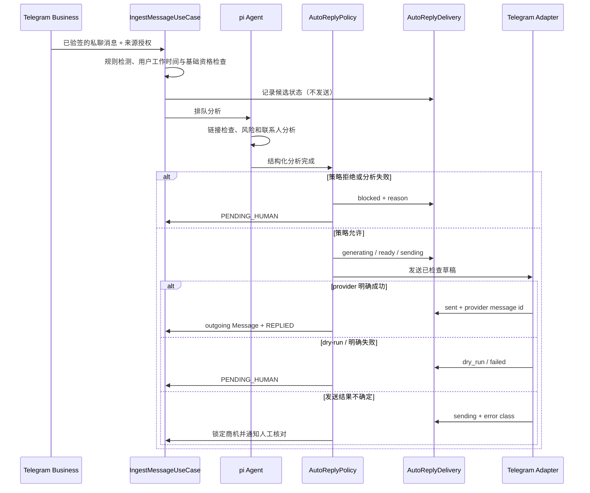

# AI Agent 安全自动回复

> 状态：实施中 · 最后核验：2026-07-15 · 适用版本：`features/safe-ai-auto-reply`

## 目标

第一版自动回复用于非工作时间的安全接待，不承担自主销售。系统可以确认已收到明确需求，并提出
一个澄清问题；报价、合同、付款、退款、法律承诺和任何高风险动作必须进入人工审核。

核心边界是：**pi Agent 负责分析，确定性策略决定是否允许发送，IM adapter 只执行已经批准的
投递。** 模型输出、客户端状态和 Celery 任务参数都不能直接解锁发送。

## 当前问题

旧链路在消息摄取时先把非工作时间商机投入 `ai.generate_and_send_reply`，之后才排队 pi Agent。
这会产生分析与发送竞态；同时 `UserWorkSchedule.auto_reply_outside_hours` 未参与路由，Telegram 来源
没有单独授权，adapter 的 `dry_run` 回执也会被记录为 `REPLIED`。这些行为在本方案上线后必须停止。

## 产品规则

### 必须同时满足

1. 服务端 `AI_AUTO_REPLY_ENABLED=true`，且 `IM_SEND_ENABLED=true`。
2. 当前用户的“非工作时间自动回复”已开启，当前时间确实不在其工作时段。
3. 来源已显式开启自动回复，连接和来源仍启用且未被套餐额度暂停，Telegram Business 的
   `can_reply` 权限仍有效。
4. 第一版仅支持 Telegram Business 私聊；群组、频道、Bot 群来源和 MTProto 普通账号不自动发送。
5. 商机由确定性规则识别；语义模型或 pi Agent 补判的新商机始终转人工。
6. pi Agent 已成功完成分析，商机未归档、未被人工接管、未进入终态。
7. 置信度达到配置阈值，且不需要重大商机人工关注。
8. 消息没有未验证、可疑或恶意链接；没有价格、合同、付款、退款、法律承诺等敏感意图。
9. 同一商机没有既有自动回复投递；同一会话未触发冷却期和时间窗次数上限。
10. AI 草稿通过确定性内容检查：非空、长度受限、不含 URL、金额或承诺性表达。

任一条件不满足都 fail closed：保留商机并转为 `PENDING_HUMAN`，记录稳定的拒绝原因，不发送消息。

### 回复内容

允许的回复结构：

- 简短确认已收到需求；
- 复述非敏感需求主题；
- 最多提出一个用于人工后续处理的澄清问题；
- 明确后续将由人员确认时，可使用中性表达。

禁止模型自行提供价格、折扣、付款链接、合同条款、交付承诺、退款承诺、法律意见或未经核验的链接。

## 数据模型

### TelegramSource

新增 `auto_reply_enabled`，数据库默认 `false`。它是来源级授权，不随连接创建自动开启。只有
`BUSINESS` 连接产生且具有 `can_reply` 权限的 `PRIVATE` 来源可以在 API 中开启；其他连接类型或权限
已撤销的连接即使提交 `true` 也返回 422。

### AutoReplyDelivery

自动发送使用独立账本，不复用普通 outgoing Message 充当投递状态：

| 字段 | 用途 |
| --- | --- |
| `id` | UUID 主键 |
| `owner_user_id` / `opportunity_id` / `source_message_id` | 用户隔离与业务关联 |
| `channel` / `conversation_id` | 冷却和审计范围 |
| `idempotency_key` | 每个商机稳定唯一键 |
| `status` | `blocked/generating/ready/sending/sent/failed/dry_run/canceled` |
| `decision_reason` | 稳定原因码，不保存原始消息 |
| `content_hash` | 草稿摘要，不重复保存敏感正文 |
| `provider_message_id` | 成功时的 provider 回执 |
| `attempt_count` / 时间字段 | 运维和恢复依据 |
| `error` | 截断后的安全错误类别 |

唯一约束为 `(owner_user_id, idempotency_key)`。任务先原子预留账本，再生成草稿；发送前将状态写为
`sending`。若进程在 provider 已接收后崩溃，任务不得自动重发，记录保留为不确定状态并锁定该商机，
等待运维核对 provider 结果后再解除；此时不能直接人工重发，以免重复联系客户。只有明确 `sent` 才
创建 outgoing Message 并把商机标记为 `REPLIED`。若 provider 已明确成功而本地投影中断，后续重复
任务只补齐本地 Message/状态，绝不再次调用 provider。

## 编排

pi Agent 分析成功后才允许排队自动回复任务。分析未配置、额度不足、失败或超时时不回退到未经分析
的发送。旧的 SLA sweep 只转人工提醒，不再绕过来源授权和分析门禁。

## API 与前端

- `PATCH /api/v1/integrations/telegram/sources/{source_id}`：当前用户开启或关闭来源自动回复。
- `GET /api/v1/integrations/telegram/connections`：来源增加 `autoReplyEnabled` 和
  `autoReplyEligible`，后者由服务端连接能力决定。
- `GET/PUT /api/v1/settings/work-schedule`：已有 `autoReplyOutsideHours` 成为真实总开关。
- `POST /api/v1/opportunities/{id}/ai-draft`：前端使用真实后端草稿 API；草稿仍需人工点击发送。

设置页必须明确展示：全局生产安全阀由运维控制；用户开关和来源开关只是必要条件，不保证消息一定
自动发送。前端不得提供“强制发送”或客户端提交策略结果的入口。

## 配置

| 变量 | 默认值 | 说明 |
| --- | --- | --- |
| `AI_AUTO_REPLY_ENABLED` | `true` | 服务端功能开关；可显式设为 `false` 紧急停用 |
| `AI_AUTO_REPLY_MIN_CONFIDENCE` | `0.85` | 最低商机置信度 |
| `AI_AUTO_REPLY_COOLDOWN_MINUTES` | `720` | 同一会话成功自动回复冷却期 |
| `AI_AUTO_REPLY_WINDOW_HOURS` | `24` | 次数统计窗口 |
| `AI_AUTO_REPLY_MAX_PER_WINDOW` | `1` | 同一会话窗口内最多成功发送数 |
| `AI_AUTO_REPLY_MAX_CHARS` | `240` | 自动发送草稿最大字符数 |

`AI_AUTO_REPLY_ENABLED` 不替代 `IM_SEND_ENABLED`。两者默认开启，但任一显式设为 false 都不得产生
真实自动发送。新部署仍不会自动联系历史用户：用户日程开关、来源开关均默认关闭，迁移也会重置旧日程
授权；只有用户再次明确授权的 Business 私聊可能进入发送链路。

## 威胁与控制

- **提示词注入**：消息和网页只作为不可信数据；Agent 无发送工具；最终由纯 Python 策略判断。
- **重复发送**：数据库唯一幂等键、行锁和 at-most-once 恢复策略；发送中的未知结果不自动重试。
- **越权来源**：来源更新、查询和投递都必须带 `owner_user_id`；只允许 Business 私聊开启。
- **dry-run 假成功**：回执显式区分 `sent` 与 `dry_run`，后者不创建 outgoing Message、不改变为已回复。
- **模型危险内容**：字符数、URL、金额和承诺词确定性检查；失败转人工，不尝试改写后自动发送。
- **人工竞态**：发送前重新锁定商机和投递记录，并写入系统占用标记；已归档、已回复、跟进中或已分配
  人工时取消自动发送。处于不确定 `sending` 的记录在人工核对前禁止再次发送。
- **配置误开**：数据库用户日程与来源授权默认关闭，服务端全局能力默认开启；生产没有 mock
  entitlement 或 mock send 回退。任一授权缺失都 fail closed，全局开关仍可显式关闭。

## 可观测性与恢复

日志只记录 opportunity/delivery/source ID、决策原因、状态和错误类别，不记录消息正文、草稿正文、
Telegram session 或 provider 原始响应。运维可以按 delivery 状态统计 `blocked/sent/failed/sending`。

回滚时先设置 `AI_AUTO_REPLY_ENABLED=false`，无需删除账本或来源配置；再回滚应用。数据库 downgrade
只允许在确认没有新版本写入后执行，且会删除投递审计，因此生产通常保留迁移并只回滚代码。

## 验收场景

1. 未显式开启的来源、群组、MTProto、工作时间内消息均不发送。
2. pi 分析尚未完成或失败时不发送。
3. 可疑链接、高优先级人工关注、敏感意图和不安全草稿转人工。
4. 合格 Business 私聊在非工作时间至多发送一次，重复任务不重复投递。
5. `IM_SEND_ENABLED=false` 时不产生 outgoing Message 或 `REPLIED` 状态。
6. 人工在任务执行前回复、归档或接管时自动任务取消。
7. 前端工作时间开关与 Telegram 来源开关真实持久化，AI 草稿调用真实 API。
