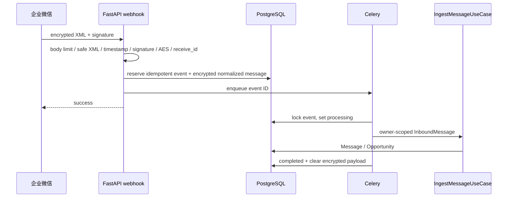

# 企业微信消息收发设计

> 状态：P0 代码已实现，待真实企业联调 · 最后核验：2026-07-14 · 适用分支：`features/wecom-message-integration`

## 目标与平台边界

本项目把企业微信能力拆成三个不同连接类型，避免把平台不支持的能力合并成一个模糊的“企微连接”。

| 类型 | 接收能力 | 发送能力 | 当前范围 |
| --- | --- | --- | --- |
| `internal_app` | 成员发给企业自建应用的消息与事件 | 自建应用向企业成员发送应用消息 | P0 实现 |
| `message_archive` | 已开通会话内容存档范围内的内部/外部单聊和群聊 | 无法代表员工在原会话回复 | P1 设计 |
| `customer_service` | 微信客服会话 | 受平台发送窗口和次数限制 | P2 设计 |

自建应用创建的内部群聊不支持接收群聊消息，群机器人也只是通知出口。因此 P0 不宣称可以监听普通
企微群；需要群聊商机监控的企业必须开通会话内容存档。P1 未获得真实企业授权和官方 SDK 前保持
关闭，不以 mock 数据或自建应用回调冒充。

## P0 用户旅程

1. 登录用户在 `/settings/wecom` 创建一套企业自建应用连接。
2. 服务端加密保存 Corp ID、Agent ID、Secret、Token 和 EncodingAESKey，并返回连接专属回调 URL。
3. 用户把回调 URL、Token 和 EncodingAESKey 配置到企业微信管理后台。
4. 企业微信通过 GET 验证回调；连接被标记为 active。
5. 成员向应用发送文本消息；回调完成验签、解密和幂等预留后快速返回 `success`。
6. Celery 从加密的短期规范化事件重建 `InboundMessage`，执行既有商机识别和 Agent 调度。
7. 人工在商机详情确认回复；后端使用该连接的应用凭据向原成员发送消息，成功后才记录 outgoing
   `Message` 并更新商机状态。

## 数据模型

### `wecom_connections`

- `id`、`owner_user_id`
- `connection_type`：P0 只允许 `internal_app`
- `display_name`、`corp_id`、`agent_id`
- `secret_encrypted`、`token_encrypted`、`aes_key_encrypted`
- `status`：`pending | active | disabled | error`
- `last_verified_at`、`last_error`
- 唯一约束 `(owner_user_id, corp_id, agent_id)`

P0 每个用户最多创建一条连接，但数据库不使用 `owner_user_id` 唯一约束，为后续付费多连接保留结构。
所有秘密复用 `core.security` 的服务端加密封装，API 不返回密文、明文或可推断秘密的摘要。

### `wecom_sources`

- `id`、`connection_id`、`owner_user_id`
- `external_conversation_id`、`display_name`、`source_type`
- `receive_capability`、`send_capability`
- `enabled`、`quota_paused`、`last_message_at`
- 唯一约束 `(connection_id, external_conversation_id)`

P0 成员私聊来源自动发现，不计入“企微群监控”额度。P1 群来源才进入 `wecomGroupsUsed` 和套餐
reconcile；降级只设置 `quota_paused`，不删除消息或来源。

### `wecom_webhook_events`

- provider event ID 在连接内唯一，约束 `(connection_id, provider_event_id)`。
- 长期只保留 payload hash、事件类型、状态、尝试次数和时间戳。
- 待处理期间保存加密后的规范化 `InboundMessage`；完成或最终失败后清空。
- 不保存原始 XML、HTTP Header、Token、AES Key 或完整解密 payload。

## Webhook 与异步处理



事件重复到达时，completed/processing/queued 都返回成功；processing 使用 10 分钟处理租约，只有超时任务才可恢复。failed 事件可以重新排队但不新增记录。外部
消息 ID 和 conversation ID 都加入 connection ID 命名空间，防止不同企业碰撞。未知消息类型安全忽略。

## 发送与状态一致性

- `IM_SEND_ENABLED=false` 时只返回 dry-run receipt，不执行真实网络发送。
- 只有 `send_capability=app_message`、连接 active、来源 enabled 且未 quota paused 时允许发送。
- `message_archive` 来源只能生成和复制草稿，发送 API 返回 409。
- 发送使用本地 idempotency key；同一个操作重试不能产生第二条 provider 请求。
- provider 成功后才创建 outgoing Message 并更新 Opportunity；失败保持原状态。
- AI 自动回复默认不对新企微连接开放。本期只交付人工批准后的真实发送。
- 人工回复 API 对用户级企微会话强制要求 `Idempotency-Key`，操作人取当前 JWT 用户，不信任客户端的 operator ID。

## API

```text
GET    /api/v1/integrations/wecom/connections
POST   /api/v1/integrations/wecom/connections
POST   /api/v1/integrations/wecom/connections/{id}/verify
DELETE /api/v1/integrations/wecom/connections/{id}
GET    /api/v1/integrations/wecom/sources

GET    /api/v1/webhooks/wecom/{connection_id}
POST   /api/v1/webhooks/wecom/{connection_id}
```

连接管理接口使用网站 JWT 且按 owner 隔离；webhook 不使用网站 JWT，只依赖连接专属企微验签。旧的
`/webhooks/wecom` 与全局 `WECOM_*` 在迁移期保留，不作为新用户入口。

## 安全与运维

- XML body、文本、名称和 ID 都有长度上限；DOCTYPE/ENTITY 输入拒绝。
- 签名使用 constant-time compare，timestamp 默认容差 300 秒。
- access token Redis key 包含 connection ID，不跨企业共享。
- 日志只记录 connection/event/message ID 和稳定错误类，不记录正文、凭据或 provider 完整响应。
- 删除连接先禁用；已有 Message/Opportunity 保留，秘密和未处理事件 payload 清除。
- 生产没有用户级连接时应用正常运行；全局占位配置不能让 UI 显示“已连接”。

## P1 会话内容存档

P1 新增独立 poller、官方 Finance SDK 封装、RSA 私钥加密、`seq` 游标和群来源选择。它只摄取已授权
范围，不提供原会话发送；媒体默认不下载。详细授权、模型和部署边界见
[企业微信会话内容存档设计](wecom-conversation-archive.md)。上线前必须完成企业认证、功能购买、员工告知、
外部联系人同意、调用 IP 白名单、数据保留策略和真实测试企业验证。

## 验收矩阵

- 密码学固定向量：URL 验证、签名错误、过期 timestamp、错误 receive ID、非法 padding。
- webhook：快速 ACK、重复事件、未知类型、超限 body、恶意 XML、入队失败。
- owner：连接、来源、商机和发送均不能跨用户访问。
- worker：重复执行、失败重试、最终失败清密文、无 owner fail closed。
- 发送：disabled/dry-run/active/provider error/幂等重试，失败不改变商机状态。
- 前端：未配置、保存中、待验证、active、错误、删除确认和秘密不回显。

## 人工联调步骤

1. 在企业微信管理后台创建内部自建应用，记录 CorpID、AgentID 和 Secret。
2. 在产品 `/settings/wecom` 创建连接，使用自行生成的 Token 和 43 位 EncodingAESKey。
3. 将页面返回的专属 Callback URL、同一 Token 和 EncodingAESKey 配置到“接收消息”，并完成 URL 验证。
4. 确保 Cloudflare Tunnel 把 `/api/*` 转发给 FastAPI，且 Celery worker 监听 `im` queue。
5. 成员在企微应用会话中发送文本，确认看板生成待人工商机；再从详情页回复。
6. 真实发送需要 `IM_SEND_ENABLED=true`；为 false 时只进行可审计 dry-run，不会投递到企微。

真实企业后台的 URL 验证、入站回调和出站发送未在本地环境伪造为通过，发布前必须按上述步骤做隔离测试企业联调。
