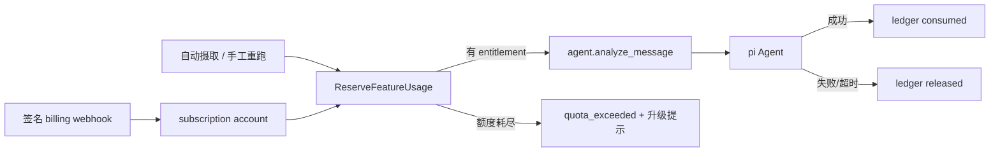

# 订阅体系与 pi Agent 用量额度

> 状态：active · Owner：待定 · 创建/更新：2026-07-11

## 目标与用户价值

建立可审计、并发安全的订阅 entitlement 与功能用量体系：非订阅用户只能在明确周期内使用有限次
pi Agent，订阅用户按套餐获得更高额度或更多能力；达到上限时系统给出可解释的升级入口，而不是
继续产生不可控模型成本或静默丢消息。

## 非目标

- 不用 Redis 自增值作为唯一账本；Redis 可做缓存，PostgreSQL 必须是计费真相源。
- 不把模型调用失败、Celery 自动重试或幂等重复任务计为用户已消费次数。
- 不在确定支付渠道、退款/取消语义和税务主体前接入真实收费。
- 不把套餐判断写进 pi prompt；entitlement 与额度执行属于确定性 application/domain 策略。

## 当前事实与立即风险

- `PI_AGENT_ENABLED` 从 2026-07-11 起默认开启；有效 provider key 会分析所有成功入队的可归属消息。
- 当前只有全局开关，没有订阅、免费额度、usage ledger 或升级 API，因此非订阅用户暂时不受次数
  限制。上线额度前需设置 DeepSeek 预算告警，并保留全局 kill switch。
- `Message.owner_user_id` 可为空。没有 owner 的 webhook 消息无法可靠归属用户额度，必须先定义租户
  归属；推荐在没有显式 system tenant 时不为 owner 为空的消息预留付费额度。
- 自动摄取与手工“重新分析”都能入队；计量必须在两个入口共享同一个原子预留用例。

## 推荐计量口径

- feature key：`pi_agent_analysis`；计量单位：一次成功完成的独立分析。
- 自动分析按 `(owner_user_id, message_id, analysis_version)` 建唯一幂等键；Celery 重试和重复摄取不
  重复扣减。
- 手工重新分析生成新的 `analysis_version`，成功时消耗一次；相同 request id 的重复提交不重复扣减。
- enqueue 前原子创建 `reserved` ledger；成功转 `consumed`，确定性失败/超时转 `released`。并发请求
  通过数据库唯一约束和行锁共享同一余额判断。
- 周期建议使用订阅 billing period；免费用户使用 UTC 自然月。具体免费次数和各套餐额度尚待产品
  确认，不在代码中猜测。

## 建议数据模型

- `subscription_accounts`：`user_id` 唯一、billing provider/customer/subscription ID、plan code、
  status、period start/end、cancel-at-period-end、provider event version。
- `usage_ledger`：user、feature、quantity、period、idempotency key、source message、analysis version、
  `reserved/consumed/released` 状态、时间和非敏感失败原因。
- 套餐与 entitlement：首版使用版本化 plan catalog（free/pro/team）映射额度和功能开关；管理端只
  选择 plan code，不能任意写剩余额度。未来需要运营配置时再迁移到带版本的数据库 catalog。
- 可选 `usage_rollups` 只做查询优化；余额判定必须能由 ledger 重建和对账。

## 执行边界

## 验收标准

- [ ] 产品确定支付渠道、free/pro/team 套餐、周期、具体额度和超额策略。
- [ ] owner 为空的消息有明确租户归属或 fail-closed 行为。
- [ ] 自动分析与手工重跑在 enqueue 前共享原子额度预留；并发越界请求只有允许数量成功。
- [ ] 失败、超时、Celery 重试和重复 webhook 不重复扣费；成功分析恰好消费一次。
- [ ] billing webhook 验签、事件幂等、乱序保护、取消/欠费/退款状态转换有测试。
- [ ] 用户 API/UI 可查看当前套餐、周期用量、剩余额度和升级入口；跨用户访问被拒绝。
- [ ] 管理/客服调整有审计日志，不允许直接修改 usage rollup 掩盖 ledger。
- [ ] migration 在临时 PostgreSQL 完成 upgrade/downgrade/upgrade，并有并发数据库测试。
- [ ] 功能地图、安全基线、运维、隐私说明和发布/回滚文档与实现一致。

## 分阶段实施

- [ ] Phase 0：确认产品/支付决策和 owner 归属；定义 plan catalog 与 API 契约。
- [ ] Phase 1：Subscription/Usage domain、迁移、repository、原子 reserve/finalize 和并发测试。
- [ ] Phase 2：接入自动摄取、重跑 API、quota_exceeded 状态、用量查询与看板提示。
- [ ] Phase 3：接入 billing provider webhook、结账/客户门户、取消/欠费/退款流程。
- [ ] Phase 4：订阅专属能力（更高额度、Pro 模型、更多监控会话、优先队列、团队席位）逐项评估。
- [ ] Phase 5：影子计量、灰度 enforce、预算/异常告警、对账与回滚演练。

## 订阅功能候选地图

| 能力 | Free | Pro 候选 | Team 候选 |
| --- | --- | --- | --- |
| pi Agent 分析 | 每月有限次数，具体值待定 | 更高月额度与可选 Pro 模型 | 共享额度池与优先队列 |
| IM 监控 | 当前免费监控数量 | 更多 Telegram/企微来源 | 团队共享来源、权限和审计 |
| 行动建议 | 查看建议，外部动作仍需审批 | 模板/批量审批候选 | 角色化审批流和双人复核 |
| 数据与提醒 | 基础看板 | 高级筛选、即时重大商机提醒 | 团队分派、SLA、导出与审计 |

所有外部自动发送仍是独立高风险能力，不能仅因订阅等级更高就绕过人工批准和
`IM_SEND_ENABLED`。

## 需要产品确认的问题

1. 支付渠道与目标市场：Stripe、国内支付、App Store/Google Play，还是先人工开通？
2. Free/Pro/Team 的月度分析次数、价格、超额后阻断还是按量付费？
3. 手工重新分析是否扣一次；管理员触发是否使用独立运营额度？
4. owner 为空的 bot/webhook 消息归属哪个 tenant，还是默认不运行 Agent？
5. 团队订阅按 workspace、席位还是共享额度计费？

## 验证记录

| 命令/场景 | 结果 |
| --- | --- |
| 规划文档与 `make harness-check` | 通过；26 Markdown 文件可达 |

## 回滚与恢复

实施前保持 `PI_AGENT_ENABLED` 全局 kill switch。额度 enforcement 上线时先做只记录不阻断的影子
计量；对账一致后再灰度阻断。异常时可关闭 enforcement 而保留 ledger 写入，不能删除或回写历史
账本。billing webhook 可暂停消费但必须保留事件以便恢复重放。

## 结果与剩余风险

当前仅完成架构规划，尚未限制非订阅用户，也未接入真实支付。
