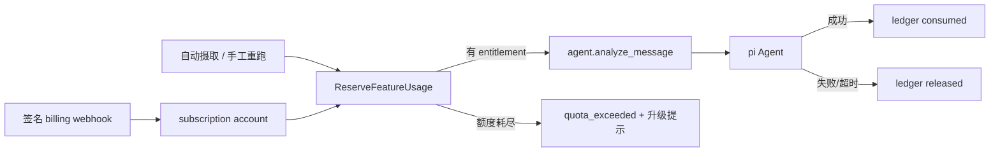

# 订阅体系与 pi Agent 用量额度

> 状态：active · Owner：待定 · 创建/更新：2026-07-11

## 目标与用户价值

建立可审计、并发安全的订阅 entitlement 与功能用量体系：非订阅用户每月最多使用 100 次
pi Agent，并且最多配置 1 个 Telegram 群和 1 个企微群；Plus、Pro、Max 用户按套餐获得更高的
群订阅数与 AI 分析额度。达到上限时系统给出可解释的升级入口，而不是继续产生不可控模型成本或
静默丢消息。

## 非目标

- 不用 Redis 自增值作为唯一账本；Redis 可做缓存，PostgreSQL 必须是计费真相源。
- 不把模型调用失败、Celery 自动重试或幂等重复任务计为用户已消费次数。
- 不在确定支付渠道、退款/取消语义和税务主体前接入真实收费。
- 不把套餐判断写进 pi prompt；entitlement 与额度执行属于确定性 application/domain 策略。

## 当前事实与立即风险

- `PI_AGENT_ENABLED` 从 2026-07-11 起默认开启；有效 provider key 会分析所有成功入队的可归属消息。
- 已有版本化套餐目录、`subscription_accounts`、`usage_ledger`、用户用量 API/UI 和入队前额度执行；
  仍未接支付/升级 API，因此目前只有数据库中存在有效订阅账户的用户会获得付费额度。
- `Message.owner_user_id` 可为空。没有 owner 的 webhook 消息当前 fail closed，不运行 pi Agent、也不
  消耗额度；未来若引入 system tenant，必须显式迁移归属规则。
- 自动摄取与手工“重新分析”已经共享 `ScheduleAgentAnalysisUseCase` 原子预留路径。

## 推荐计量口径

- feature key：`pi_agent_analysis`；计量单位：一次成功完成的独立分析。
- 自动分析使用 message 级稳定幂等键；Celery 重试和重复摄取不重复扣减。
- 手工重新分析使用 HTTP `Idempotency-Key`；新的 key 消耗一次，相同 key 的重复提交不重复扣减。
- enqueue 前原子创建 `reserved` ledger；成功转 `consumed`，确定性失败/超时转 `released`。并发请求
  通过数据库唯一约束和行锁共享同一余额判断。
- 周期使用套餐当前 billing period；Free 用户使用 UTC 自然月。套餐切换不能改写已产生的 ledger，
  升级立即使用新上限，降级在下一周期生效。
- 产品额度按顶层“分析任务”计数，而不是按 pi 内部多轮模型请求计数；同时单独记录 provider 请求数、
  token 和成本用于预算告警。这样用户额度稳定，也能保留真实成本观测。此口径在实现前仍需产品确认。

## 首版套餐目录

plan code 固定使用小写 `free`、`plus`、`pro`、`max`，展示名称与本地化文案不参与权限判断。

| 套餐 | Telegram 群上限 | 企微群上限 | TG + 企微合计上限 | 每月 AI 分析次数 |
| --- | ---: | ---: | ---: | ---: |
| Free（非订阅） | 1 | 1 | 2 | 100 |
| Plus | 不单独限制 | 不单独限制 | 10 | 1,000 |
| Pro | 不单独限制 | 不单独限制 | 50 | 5,000 |
| Max | 不单独限制 | 不单独限制 | 100 | 10,000 |

付费档的 10/50/100 个群暂按 Telegram 与企微合计计算，例如 Plus 可以配置 10 个 TG 群，也可以
配置 4 个 TG 群和 6 个企微群。Free 按产品要求保留两个渠道各 1 个的独立限制。若产品希望付费档
也按渠道分别计算，只需调整 plan catalog，不应修改业务用例。

套餐目录首版保存在版本化代码配置中，并暴露以下稳定 entitlement：

- `telegram_group_limit`、`wecom_group_limit`：Free 均为 1；付费档为空表示只受合计上限约束。
- `combined_group_limit`：Free/Plus/Pro/Max 分别为 2/10/50/100。
- `pi_agent_analysis_monthly_limit`：分别为 100/1,000/5,000/10,000。
- 不把价格、模型选择、优先队列或自动外发权限隐式绑定到套餐；这些能力另行决策和版本化。

## 建议数据模型

- `subscription_accounts`：`user_id` 唯一、billing provider/customer/subscription ID、plan code、
  status、period start/end、cancel-at-period-end、provider event version。
- `usage_ledger`：user、feature、quantity、period、idempotency key、source message、analysis version、
  `reserved/consumed/released` 状态、时间和非敏感失败原因。
- 套餐与 entitlement：首版使用版本化 plan catalog（free/plus/pro/max）映射额度和功能开关；管理端只
  选择 plan code，不能任意写剩余额度。未来需要运营配置时再迁移到带版本的数据库 catalog。
- `monitored_group_subscriptions`（或复用现有群配置表）：记录 owner、平台、平台群 ID、启用状态；
  `(owner_user_id, platform, external_group_id)` 唯一。创建或重新启用时在同一事务内锁定订阅账户并
  校验渠道/合计上限，停用后立即释放名额。
- 可选 `usage_rollups` 只做查询优化；余额判定必须能由 ledger 重建和对账。

## 执行边界

## 验收标准

- [x] 首版套餐及群数量、月度 AI 分析额度已确定为 Free/Plus/Pro/Max 四档。
- [ ] 产品确定支付渠道、套餐价格、付费周期和超额策略。
- [x] owner 为空的消息按 fail-closed 处理，不运行 Agent、不占用户额度。
- [ ] 新增/启用 TG 与企微群时原子校验套餐额度；并发创建不能突破渠道或合计上限。
- [ ] 套餐降级不会静默删除群，并由用户选择保留哪些群；Telegram 已完成，用户级企微群配置待实现。
- [x] 自动分析与手工重跑在 enqueue 前共享原子额度预留；并发越界请求只有允许数量成功。
- [x] 入队失败、最终重试失败和幂等重复不重复扣费；成功分析恰好消费一次。
- [ ] billing webhook 验签、事件幂等、乱序保护、取消/欠费/退款状态转换有测试。
- [x] 用户 API/UI 可查看当前套餐、周期用量、剩余额度和升级占位；查询只使用当前认证用户。
- [ ] 管理/客服调整有审计日志，不允许直接修改 usage rollup 掩盖 ledger。
- [x] migration 在临时 PostgreSQL 完成 upgrade/downgrade/upgrade，并有并发数据库测试。
- [x] 功能地图、架构、运维和发布/回滚文档与当前实现一致。

## 分阶段实施

- [ ] Phase 0：确认支付、计数口径和 owner 归属；冻结 plan catalog 与 API 契约。
- [x] Phase 1：Subscription/Usage domain、迁移、repository、原子 reserve/finalize、群额度策略和并发测试。
- [ ] Phase 2：接入群配置、自动摄取、重跑 API、quota_exceeded 状态、用量查询与看板提示。
- [ ] Phase 3：接入 billing provider webhook、结账/客户门户、取消/欠费/退款流程。
- [ ] Phase 4：订阅专属能力（可选 Pro 模型、优先队列、团队席位）逐项评估，不能改变已承诺的基础额度。
- [ ] Phase 5：影子计量、灰度 enforce、预算/异常告警、对账与回滚演练。

## 订阅功能候选地图

| 能力 | Free | Plus | Pro | Max |
| --- | --- | --- | --- | --- |
| pi Agent 分析 | 100 次/月 | 1,000 次/月 | 5,000 次/月 | 10,000 次/月 |
| IM 群监控 | 1 TG + 1 企微 | 合计 10 个群 | 合计 50 个群 | 合计 100 个群 |
| 行动建议 | 查看建议，外部动作仍需审批 | 同 Free | 模板/批量审批候选 | 角色化审批流候选 |
| 数据与提醒 | 基础看板 | 用量与额度看板 | 高级筛选候选 | 团队分派、SLA、审计候选 |

所有外部自动发送仍是独立高风险能力，不能仅因订阅等级更高就绕过人工批准和
`IM_SEND_ENABLED`。

## 实施进度与发现

- 已完成 Free/Plus/Pro/Max catalog、订阅账户、用量账本、自动/手工分析额度执行、Telegram 动态群
  上限、`GET /subscriptions/plans`、`GET /subscriptions/me` 和 `/settings/subscription`。
- Telegram listener 会在每次配置刷新时重新校验当前套餐，套餐到期后的超额 monitor 标记
  `quota_paused` 且不会被删除；用户可在设置页选择额度内保留群，选择优先级会跨升级保留。
- PostgreSQL 并发测试以同一 Free 用户同时发起 105 次不同幂等请求，恰好 100 次预留成功；相同
  幂等键只分配一次。
- 企业微信当前是全局 webhook，没有用户级真实群配置。因此 entitlement 已包含企微和合计额度，
  但尚不能接入企微群创建限制；不能把设置页静态“已连接”卡片当成已交付配置能力。
- 套餐降级选群、支付、升级操作、客服调整审计、provider 原始请求/token/成本指标仍未实现。

## 需要产品确认的问题

1. 支付渠道与目标市场：Stripe、国内支付、App Store/Google Play，还是先人工开通？
2. Plus/Pro/Max 的群上限是否确认按 TG 与企微合计，而不是每个平台各 10/50/100 个？
3. 一次 pi 分析内部可能产生多轮 provider 请求：用户额度按顶层分析任务计一次是否确认？
4. 套餐价格、付费周期，以及额度耗尽后硬阻断、购买加量包还是允许按量付费？
5. 手工重新分析是否扣一次；管理员触发是否使用独立运营额度？
6. owner 为空的 bot/webhook 消息归属哪个 tenant，还是默认不运行 Agent？

## 验证记录

| 命令/场景 | 结果 |
| --- | --- |
| 规划文档与 `make harness-check` | 通过；27 Markdown 文件可达 |
| 后端目标与全量 pytest | 无数据库环境 40 passed/3 skipped；临时 PostgreSQL 43 passed |
| 临时 PostgreSQL migration | 订阅迁移与 retention 迁移均完成 upgrade/downgrade/upgrade |
| 并发 Free 额度 | 105 个并发预留中恰好 100 个成功 |
| 前端 lint / typecheck | 通过 |

## 回滚与恢复

继续保持 `PI_AGENT_ENABLED` 全局 kill switch。异常时可关闭 Agent 执行，但不得删除或回写历史
账本。billing webhook 上线后可暂停消费，但必须保留事件以便恢复重放。

## 结果与剩余风险

当前完成不依赖支付渠道的第一条生产切片：非订阅用户 AI 月额度与 Telegram 群额度已经执行，付费
套餐 catalog/账户已可生效，用户可查看用量。尚未接入真实支付、用户级企微群配置、降级选群、客服
审计和成本指标，因此计划保持 active。
